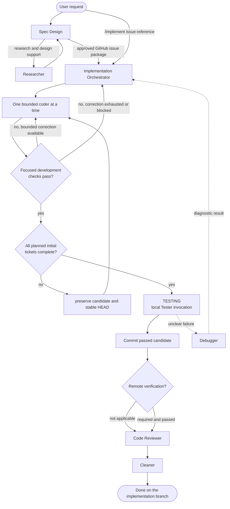

# Agent Workflow

This document is an architecture and topology map, plus a happy-path overview
of the configured agents. The authoritative contract for exact states,
transitions, gates, budgets, blockers, and repository-lifecycle invariants is
[`orchestrator-state-machine.md`](./orchestrator-state-machine.md).
Agent configuration lives in [`opencode/agents/`](../../opencode/agents/), and
the runtime configuration is
[`opencode/opencode.jsonc`](../../opencode/opencode.jsonc).

## Happy path

Spec Design owns discovery and design, using `grilling` (or the existing
`grill-with-docs` skill), research, domain modeling, and codebase design as
needed. It publishes an approved package as a GitHub Issue and returns its
Issue Reference. The explicit `/setup-matt-pocock-skills` command is separate
from this flow and configures GitHub-only conventions after confirmation; it is
not invoked automatically.

`spec-design` remains the default primary agent, while
`implementation-orchestrator` is the independent primary agent selected by
`/implement`. Plain text does not automatically switch primary agents.

The Orchestrator independently resolves and validates exactly one approved
Issue package before repository admission. Package identity includes the
target repository and the exact implementation branch. It coordinates bounded
coders, then delegates the complete verification matrix to Tester before the
review stages. The candidate and implementation commit remain on that
approved branch; completion does not merge into the default branch.

Debugger is an Orchestrator leaf: it diagnoses a consolidated unclear failure
and cannot delegate or implement. Code Reviewer runs only after applicable
Tester evidence passes. A Code Reviewer `BLOCKED: HEAD_MISMATCH` is a lifecycle
failure and routes to `BLOCKED_OPERATION`. All other routing, including correction
cycles and escalation, is defined only by the state-machine authority linked
above.

## Repository lifecycle guard

The Orchestrator admits only an unambiguous clean repository state, validates
the expected branch, tip, target repository, and accumulated candidate before
delegation, and preserves work on drift. A local Tester pass is required
before the first implementation commit or push. The full admission, commit,
remote-verification, and `BLOCKED_OPERATION` contracts are centralized in
[`orchestrator-state-machine.md`](./orchestrator-state-machine.md).

Native `Task` provides neither timeouts nor isolated-directory routing. These
are not claimed by this workflow; follow-up work should specify external
supervision or an explicitly provisioned isolated environment if needed.

## Configured agents

| Agent | Path | Delegated by | Relevant skills | Notes |
| --- | --- | --- | --- | --- |
| Spec Design | [`opencode/agents/spec-design.md`](../../opencode/agents/spec-design.md) | Primary agent | `grilling`, `grill-with-docs`, `domain-modeling`, `codebase-design`, `to-spec`, `github`, `setup-matt-pocock-skills` | May edit domain, ADR, and specification documents; production edits remain denied. |
| Researcher | [`opencode/agents/researcher.md`](../../opencode/agents/researcher.md) | Spec Design | None | Edit and delegation are denied; returns evidence, options, unknowns, and follow-up questions. |
| Implementation Orchestrator | [`opencode/agents/implementation-orchestrator.md`](../../opencode/agents/implementation-orchestrator.md) | Primary agent or `/implement` | None | Resolves one approved issue package before admission; edit denied; owns orchestration. |
| coder-qwen | [`opencode/agents/coder-qwen.md`](../../opencode/agents/coder-qwen.md) | Orchestrator | None | Bounded implementation worker for small mechanical tickets. |
| coder-gpt | [`opencode/agents/coder-gpt.md`](../../opencode/agents/coder-gpt.md) | Orchestrator | None | Bounded implementation worker for complex or subtle tickets. |
| Debugger | [`opencode/agents/debugger.md`](../../opencode/agents/debugger.md) | Orchestrator | None | Diagnostic-only leaf; disposable artifacts may only be written under `/tmp`. |
| Tester | [`opencode/agents/tester.md`](../../opencode/agents/tester.md) | Orchestrator | None | Sole Verification Matrix authority; returns `PASS` or `NOT_PASS`. |
| Code Reviewer | [`opencode/agents/code-reviewer.md`](../../opencode/agents/code-reviewer.md) | Orchestrator | None | Read-only review after Tester passes; returns one verdict and all findings. |
| Cleaner | [`opencode/agents/cleaner.md`](../../opencode/agents/cleaner.md) | Orchestrator | None | Read-only final simplification lens after Code Reviewer approval. |

## Skills and supporting paths

Configured skills are under [`opencode/skills/`](../../opencode/skills/). The
workflow uses `grilling`, the existing `grill-with-docs`, `domain-modeling`,
`codebase-design`, `to-spec`, and `github`. Repository conventions are in
[`docs/issue-tracker.md`](../issue-tracker.md) and [`docs/domain.md`](../domain.md).
Domain context is [`CONTEXT.md`](../../CONTEXT.md); no `docs/adr/` directory
currently exists. Direct commands are `implement` and
`setup-matt-pocock-skills`.

## MCP and runtime capabilities

The only configured MCP server in
[`opencode/opencode.jsonc`](../../opencode/opencode.jsonc) is the enabled local
Podman `playwright` container (`podman run --rm -i --ipc=host mcp/playwright`).
There is no MCP implementation or additional server in this repository.

The default primary agent is `spec-design`, LSP is enabled globally, and
`subagent_depth` is `1`. Spec Design and the Orchestrator are independent
primary agents. The Orchestrator and Debugger may use `/tmp`; coders are
denied external-directory access. No credentials or other external service
paths are declared. CI overrides Playwright to disabled, so it does not need
Podman.

## Authority notes

- This map describes configured intent, not a guarantee that every named skill
  or agent is installed by the runtime.
- [`orchestrator-state-machine.md`](./orchestrator-state-machine.md) is the
  source of truth for Orchestrator states, transitions, gates, budgets,
  blockers, and invariants.
- GitHub Issues are the issue/specification surface; operational commands are
  documented in [`issue-tracker.md`](../issue-tracker.md).
