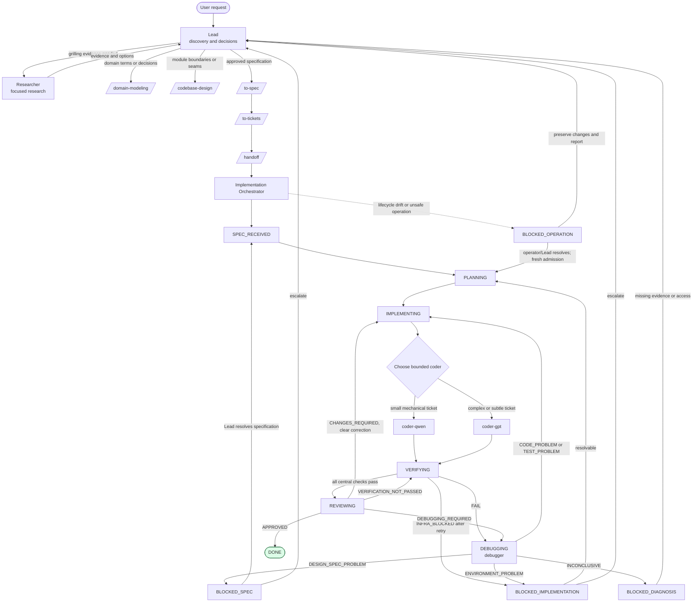

# Agent Workflow

This document is a map of the configured agent structure. The authoritative
orchestrator states and invariants are in [`CONTEXT.md`](../../CONTEXT.md).
Agent configuration lives in [`opencode/agents/`](../../opencode/agents/), and
the OpenCode runtime configuration is
[`opencode/opencode.jsonc`](../../opencode/opencode.jsonc).

## End-to-end workflow

The Lead remains user-facing. It must not implement production code. The Lead
and Orchestrator are the delegation layers, with one narrow exception: the
Researcher may delegate repository exploration to `explore`. The Orchestrator
is the implementation boundary: it schedules coders, performs central
verification, routes failures, and returns completion or escalation to the
Lead. The reviewer is only called after central verification passes.

## Repository lifecycle guard

When creating an implementation branch from the original/default branch, the
Orchestrator captures the original branch/ref and exact tip baseline before
creating it. It then admits only a clean
worktree (staged, unstaged, and
untracked changes block; ignored files are permitted), a non-detached HEAD,
resolved default branch, and no active/incomplete operation, lock, or
ambiguous ref/index/metadata state. Admission records the exact branch and
commit. On the default branch it creates and switches to an implementation
branch; otherwise it uses the clean usable non-default branch as-is. That
branch is the implementation tip and no original-branch integration occurs.

Coders are always sequential. Immediately before each delegation, the
Orchestrator alone validates that the current branch and exact current tip
match the assignment's admitted branch and expected tip; a mismatch blocks
delegation. Assignments provide the admitted branch, immutable baseline commit,
exact current expected implementation tip, and exact scopes as immutable
context. The immutable baseline is not the current tip for later sequential
tickets. Coders validate assignment completeness and allowed scope, obey the
scope, and do not inspect repository Git or metadata. They do not issue Git
commands or modify `.git`; that is accidental protection, not sandboxing. The
Orchestrator alone explicitly stages and makes meaningful, non-empty
issue-linked commits identifying the approved issue or ticket, after unit checks
pass. Guarded
fast-forward-only baseline operations are allowed. Any unexpected branch, ref,
index, metadata, untracked, or out-of-scope drift stops non-destructively,
preserves changes, and is reported as `BLOCKED_OPERATION`. Task
crashes/cancellations and invocation/tool failures also route to
`BLOCKED_OPERATION`.

After reviewer approval, when an implementation branch was created from the
original/default branch, validate that the original branch/ref exactly equals
the captured baseline, the implementation branch/HEAD exactly equals the
reviewed commit, and the worktree is clean. Fast-forward only advances the
original branch to the reviewed tip; then validate the final original
branch/HEAD is the clean reviewed tip. For a clean non-default branch used
as-is, the reviewed implementation tip is already the result and no
original-branch integration occurs. Any mismatch, drift, or integration
failure is `BLOCKED_OPERATION`, preserving the implementation branch, commits,
and worktree: do not merge, rebase, force-update, reset, restore, clean,
stash, push, or delete the implementation branch. A clean tip and matching
lifecycle snapshot are required for final verification and review.

The `BLOCKED_OPERATION` report contract includes the failed operation, expected
vs observed state, completed checks, preserved branch/commit/worktree state,
and exact retry/operator action.

Native `Task` provides neither timeouts nor isolated-directory routing. These
are not claimed by this workflow; follow-up work should specify external
supervision or an explicitly provisioned isolated environment if needed.

## Configured agents

| Agent | Path | Delegated by | Relevant skills | Notes |
| --- | --- | --- | --- | --- |
| Lead | [`opencode/agents/lead.md`](../../opencode/agents/lead.md) | Primary agent | `grilling`, `grill-with-docs`, `domain-modeling`, `codebase-design`, `to-spec`, `to-tickets`, `handoff` | Edit denied; can delegate `researcher` and `implementation-orchestrator`. |
| Researcher | [`opencode/agents/researcher.md`](../../opencode/agents/researcher.md) | Lead | `research` | Edit is denied; delegation is allowed only to `explore`. Returns evidence, options, unknowns, and follow-up questions. |
| Implementation Orchestrator | [`opencode/agents/implementation-orchestrator.md`](../../opencode/agents/implementation-orchestrator.md) | Lead | `tdd`, `handoff` | Edit denied; delegates coders, debugger, and reviewer; owns the state machine. |
| coder-qwen | [`opencode/agents/coder-qwen.md`](../../opencode/agents/coder-qwen.md) | Orchestrator | `tdd`, `diagnosing-bugs` | Bounded implementation worker for small mechanical tickets; forced to return after 20 agentic iterations. |
| coder-gpt | [`opencode/agents/coder-gpt.md`](../../opencode/agents/coder-gpt.md) | Orchestrator | `tdd`, `diagnosing-bugs` | Bounded implementation worker for complex, cross-module, or subtle tickets. |
| Debugger | [`opencode/agents/debugger.md`](../../opencode/agents/debugger.md) | Orchestrator or reviewer escalation | `diagnosing-bugs` | Diagnostic-only; tracked artifacts may only be written under `/tmp`. |
| Reviewer | [`opencode/agents/reviewer.md`](../../opencode/agents/reviewer.md) | Orchestrator | `code-review` | Read-only final review; returns `APPROVED`, `CHANGES_REQUIRED`, or `DEBUGGING_REQUIRED`. |

## Skills and supporting paths

Configured skill definitions are under [`opencode/skills/`](../../opencode/skills/).
The main workflow references these paths:

- Discovery and design: `grilling`, `grill-with-docs`, `research`, `domain-modeling`, and `codebase-design`.
- Specification and decomposition: `to-spec`, `to-tickets`, and `handoff`.
- Implementation and failure handling: `tdd` and `diagnosing-bugs`.
- Completion: `code-review`.
- Repository conventions: [`docs/issue-tracker.md`](../issue-tracker.md) and [`docs/domain.md`](../domain.md).
- Domain context: [`CONTEXT.md`](../../CONTEXT.md); no `docs/adr/` directory currently exists.

The following names are referenced by agent configuration or supporting skill
text but have no matching directory under `opencode/skills/` or agent file
under `opencode/agents/` in this repository: `ask-matt`, `wayfinder`,
`prototype`, and `explore`. They may be supplied by the surrounding OpenCode
installation, but their repository-local definitions are absent. The Lead's
and Researcher's permissions therefore document intended runtime capabilities,
not locally verifiable implementations.

## MCP and runtime capabilities

The only MCP server configured in
[`opencode/opencode.jsonc`](../../opencode/opencode.jsonc) is:

| Server | Type and command | Enabled | Repository-local evidence |
| --- | --- | --- | --- |
| `playwright` | Local Podman container: `podman run --rm -i --ipc=host mcp/playwright` | Yes; timeout `1800` | Configuration only; no MCP implementation or additional server is stored in this repository. |

The default primary agent is `lead`, LSP is enabled globally, and
`subagent_depth` is `2`. The Orchestrator and
Debugger may use `/tmp` and `/tmp/**` as external directories; coders are
denied external-directory access. No other MCP servers, MCP-specific agent
bindings, credentials, or external service paths are declared in the
repository configuration.

## Absence and authority notes

- Worktree-based execution is explicitly out of scope for now; this workflow
  does not define or require worktrees as a feature.
- This map describes configured intent, not a guarantee that every named skill or agent is installed by the runtime.
- `CONTEXT.md` is the source of truth for the Orchestrator state names, legal transitions, and invariants.
- GitHub Issues are the issue/specification surface; operational commands are documented in `issue-tracker.md`.
- Missing local definitions listed above should be resolved by checking the active OpenCode installation before relying on them.
