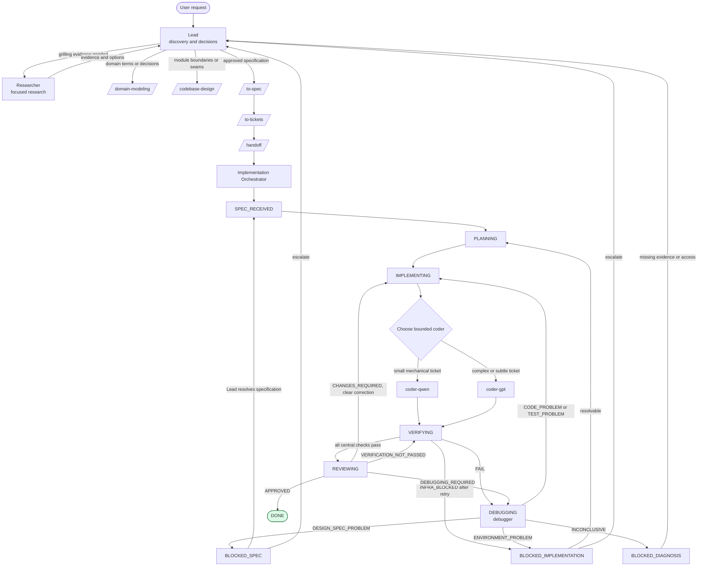

# Agent Workflow

This document is a map of the configured agent structure. The authoritative
orchestrator states and invariants are in [`CONTEXT.md`](../../CONTEXT.md).
Agent configuration lives in [`opencode/agents/`](../../opencode/agents/), and
the OpenCode runtime configuration is
[`opencode/opencode.jsonc`](../../opencode/opencode.jsonc).

## End-to-end workflow

The Lead remains user-facing. It must not implement production code. The
Orchestrator is the implementation boundary: it schedules coders, performs
central verification, routes failures, and returns completion or escalation to
the Lead. The reviewer is only called after central verification passes.

## Configured agents

| Agent | Path | Delegated by | Relevant skills | Notes |
| --- | --- | --- | --- | --- |
| Lead | [`opencode/agents/lead.md`](../../opencode/agents/lead.md) | Primary agent | `grilling`, `grill-with-docs`, `domain-modeling`, `codebase-design`, `to-spec`, `to-tickets`, `handoff` | Edit denied; can delegate `researcher` and `implementation-orchestrator`. |
| Researcher | [`opencode/agents/researcher.md`](../../opencode/agents/researcher.md) | Lead | `research` | Edit denied; may delegate `explore`. Returns evidence, options, unknowns, and follow-up questions. |
| Implementation Orchestrator | [`opencode/agents/implementation-orchestrator.md`](../../opencode/agents/implementation-orchestrator.md) | Lead | `tdd`, `handoff` | Edit denied; delegates coders, debugger, and reviewer; owns the state machine. |
| coder-qwen | [`opencode/agents/coder-qwen.md`](../../opencode/agents/coder-qwen.md) | Orchestrator | `tdd`, `diagnosing-bugs` | Bounded implementation worker for small mechanical tickets. |
| coder-gpt | [`opencode/agents/coder-gpt.md`](../../opencode/agents/coder-gpt.md) | Orchestrator | `tdd`, `diagnosing-bugs` | Bounded implementation worker for complex, cross-module, or subtle tickets. |
| Debugger | [`opencode/agents/debugger.md`](../../opencode/agents/debugger.md) | Orchestrator or reviewer escalation | `diagnosing-bugs` | Diagnostic-only; tracked artifacts may only be written under `/tmp`. |
| Reviewer | [`opencode/agents/reviewer.md`](../../opencode/agents/reviewer.md) | Orchestrator | `code-review` | Read-only final review; returns `APPROVED`, `CHANGES_REQUIRED`, or `DEBUGGING_REQUIRED`. |

## Skills and supporting paths

Configured skill definitions are under [`opencode/skills/`](../../opencode/skills/).
The main workflow references these paths:

- Discovery and design: `grilling`, `grill-with-docs`, `research`, `domain-modeling`, and `codebase-design`.
- Specification and decomposition: `to-spec`, `to-tickets`, and `handoff`.
- Implementation and failure handling: `tdd` and `diagnosing-bugs`.
- Completion: `code-review`.
- Repository conventions: [`docs/agents/issue-tracker.md`](issue-tracker.md) and [`docs/agents/domain.md`](domain.md).
- Domain context: [`CONTEXT.md`](../../CONTEXT.md); no [`docs/adr/`](../adr/) directory currently exists.

The following names are referenced by agent configuration or supporting skill
text but have no matching directory under `opencode/skills/` or agent file
under `opencode/agents/` in this repository: `ask-matt`, `wayfinder`,
`prototype`, and `explore`. They may be supplied by the surrounding OpenCode
installation, but their repository-local definitions are absent. The Lead's
and Researcher's permissions therefore document intended runtime capabilities,
not locally verifiable implementations.

## MCP and runtime capabilities

The only MCP server configured in
[`opencode/opencode.jsonc`](../../opencode/opencode.jsonc) is:

| Server | Type and command | Enabled | Repository-local evidence |
| --- | --- | --- | --- |
| `playwright` | Local Podman container: `podman run --rm -i --ipc=host mcp/playwright` | Yes; timeout `1800` | Configuration only; no MCP implementation or additional server is stored in this repository. |

LSP is enabled globally and `subagent_depth` is `2`. The Orchestrator and both
coders may use `/tmp` and `/tmp/**` as external directories. No other MCP
servers, MCP-specific agent bindings, credentials, or external service paths
are declared in the repository configuration.

## Absence and authority notes

- This map describes configured intent, not a guarantee that every named skill or agent is installed by the runtime.
- `CONTEXT.md` is the source of truth for the Orchestrator state names, legal transitions, and invariants.
- GitHub Issues are the issue/specification surface; operational commands are documented in `issue-tracker.md`.
- Missing local definitions listed above should be resolved by checking the active OpenCode installation before relying on them.
