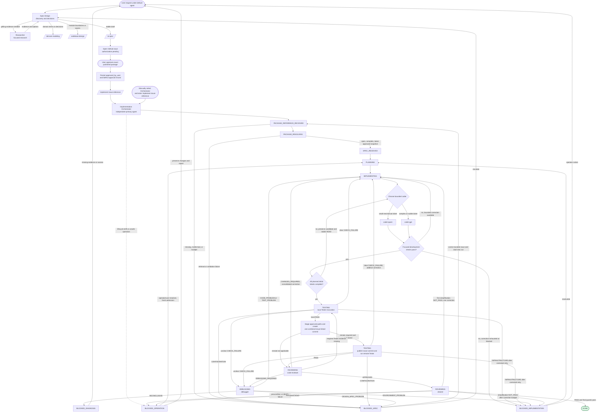

# Agent Workflow

This document is a map of the configured agent structure. The authoritative
orchestrator states and invariants are in
[`orchestrator-state-machine.md`](./orchestrator-state-machine.md).
Agent configuration lives in [`opencode/agents/`](../../opencode/agents/), and
the OpenCode runtime configuration is
[`opencode/opencode.jsonc`](../../opencode/opencode.jsonc).

## End-to-end workflow

Spec Design and the Implementation Orchestrator are separate user-facing
primary agents. Spec Design must not implement production code or invoke the
Orchestrator. It publishes a GitHub issue with authorization pending, persists
approval of the exact package in that issue, and returns its Issue Reference
and `/implement <reference>`. The Orchestrator resolves that durable reference;
it does not depend on Spec Design provenance, copied package text, or prior
conversation state. Resolution and validation complete before repository
admission. The Orchestrator then schedules at most one delegated subagent at a
time and routes completion or escalation to the user. Initial sequential coder
changes accumulate uncommitted, and coders run focused test-first development
checks. Tester remains the sole authority
for the approved Verification Matrix: it first certifies the complete local
candidate and, when required, later certifies remote results for the exact
published commit. The Code Reviewer runs only after every applicable Tester
invocation passes. Cleaner then performs one read-only simplification review.
Delegated agents cannot delegate further.

The explicit user-triggered `/setup-matt-pocock-skills` command runs via Spec Design
and configures GitHub or local Markdown tracker conventions and domain docs after
preview/confirmation. This command is separate from the normal spec/implementation
flow and is never invoked automatically.

The direct `/implement` command targets `implementation-orchestrator` with
`subtask: false` and forwards one complete Issue Reference. `spec-design`
remains the default primary agent. Plain text does not automatically switch
primary agents; users may select `implementation-orchestrator` manually before
entering `implement #57`.

## Repository lifecycle guard

The Orchestrator admits only an unambiguous clean repository state, validates
the expected branch, tip, and accumulated candidate before every delegation,
and preserves work on any drift. A local Tester `PASS` is required before the
first implementation commit or any push request. The implementation remains on
its approved branch; completion never integrates it into the default branch.
The full admission, commit, remote-verification, and `BLOCKED_OPERATION`
contracts are centralized in
[`orchestrator-state-machine.md`](./orchestrator-state-machine.md).

Native `Task` provides neither timeouts nor isolated-directory routing. These
are not claimed by this workflow; follow-up work should specify external
supervision or an explicitly provisioned isolated environment if needed.

## Configured agents

| Agent | Path | Delegated by | Relevant skills | Notes |
| --- | --- | --- | --- | --- |
| Spec Design | [`opencode/agents/spec-design.md`](../../opencode/agents/spec-design.md) | Primary agent | `grilling`, `grill-with-docs`, `domain-modeling`, `codebase-design`, `to-spec`, `github`, `setup-matt-pocock-skills` | May edit domain, ADR, and specification documents; production edits remain denied. |
| Researcher | [`opencode/agents/researcher.md`](../../opencode/agents/researcher.md) | Spec Design | None | Edit and delegation are denied. Returns evidence, options, unknowns, and follow-up questions. |
| Implementation Orchestrator | [`opencode/agents/implementation-orchestrator.md`](../../opencode/agents/implementation-orchestrator.md) | Primary agent or `/implement` | None | Resolves one approved issue package before admission; edit denied; runs at most one leaf worker at a time and owns the state machine. |
| coder-qwen | [`opencode/agents/coder-qwen.md`](../../opencode/agents/coder-qwen.md) | Orchestrator | None | Bounded implementation worker for small mechanical tickets; forced to return after 100 agentic iterations. |
| coder-gpt | [`opencode/agents/coder-gpt.md`](../../opencode/agents/coder-gpt.md) | Orchestrator | None | Bounded implementation worker for complex, cross-module, or subtle tickets. |
| Debugger | [`opencode/agents/debugger.md`](../../opencode/agents/debugger.md) | Orchestrator | None | Diagnostic-only; disposable artifacts may only be written under `/tmp`. |
| Tester | [`opencode/agents/tester.md`](../../opencode/agents/tester.md) | Orchestrator | None | Sole Verification Matrix authority; runs the supplied local or remote command scope and returns `PASS` or `NOT_PASS`. |
| Code Reviewer | [`opencode/agents/code-reviewer.md`](../../opencode/agents/code-reviewer.md) | Orchestrator | None | Read-only review after Tester passes; returns one verdict and all findings. |
| Cleaner | [`opencode/agents/cleaner.md`](../../opencode/agents/cleaner.md) | Orchestrator | None | Read-only final simplification lens after Code Reviewer approval; returns `PASS` or one consolidated `NOT_PASS`. |

## Skills and supporting paths

Configured skill definitions are under [`opencode/skills/`](../../opencode/skills/).
The main workflow references these paths:

- Discovery and design: `grilling`, `grill-with-docs`, `domain-modeling`, and `codebase-design`.
- Specification publication: `to-spec` and `github`.
- Repository conventions: [`docs/issue-tracker.md`](../issue-tracker.md) and [`docs/domain.md`](../domain.md).
- Domain context: [`CONTEXT.md`](../../CONTEXT.md); no `docs/adr/` directory currently exists.
- Direct commands: `implement` and `setup-matt-pocock-skills`.

## MCP and runtime capabilities

The only MCP server configured in
[`opencode/opencode.jsonc`](../../opencode/opencode.jsonc) is:

| Server | Type and command | Enabled | Repository-local evidence |
| --- | --- | --- | --- |
| `playwright` | Local Podman container: `podman run --rm -i --ipc=host mcp/playwright` | Yes | Configuration only; no MCP implementation or additional server is stored in this repository. |

The default primary agent is `spec-design`, LSP is enabled globally, and
`subagent_depth` is `1`. Spec Design and the Orchestrator are independent
primary agents. The Orchestrator and
Debugger may use `/tmp` and `/tmp/**` as external directories; coders are
denied external-directory access. No other MCP servers, MCP-specific agent
bindings, credentials, or external service paths are declared in the
repository configuration.

## Absence and authority notes

- Worktree-based execution is explicitly out of scope for now; this workflow
  does not define or require worktrees as a feature.
- This map describes configured intent, not a guarantee that every named skill or agent is installed by the runtime.
- `orchestrator-state-machine.md` is the source of truth for Orchestrator states, transitions, and invariants.
- GitHub Issues are the issue/specification surface; operational commands are documented in `issue-tracker.md`.
